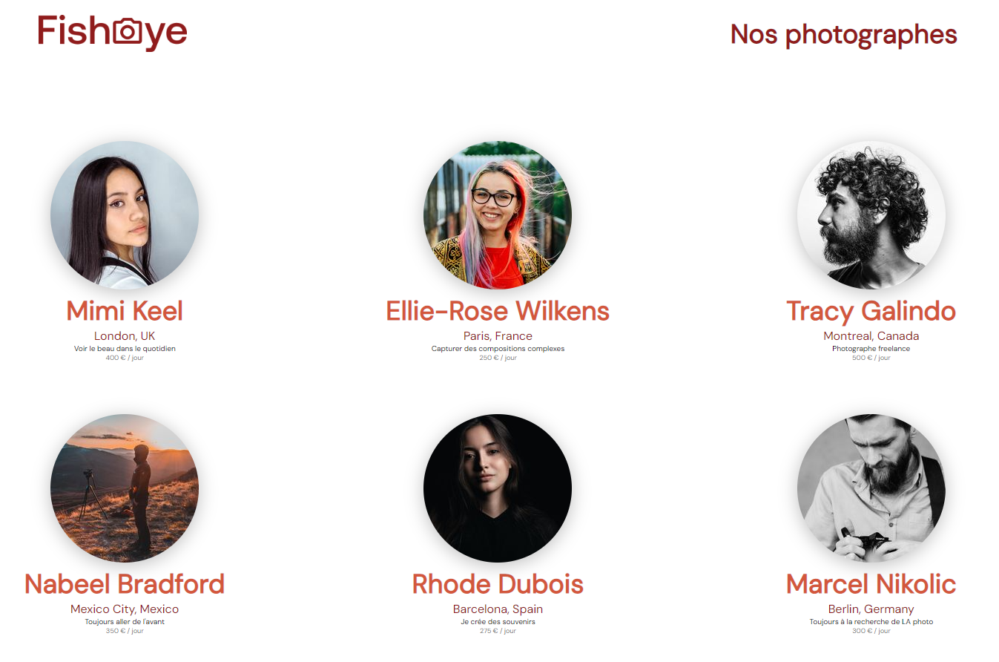

# Fisheye

Projet 6 du parcours "**Développeur d'application - JavaScript React**" chez [OpenClassroom](https://openclassrooms.com/fr/).

Créez un site accessible pour une plateforme de photographes.

## Description

Depuis quelques semaines, vous êtes développeur junior chez Techasite, une société de conseil spécialisée dans le développement de sites web et d'applications mobiles

## Tester

Vous pouvez tester le rendu de cette application [ici](https://code9g.github.io/Fisheye/)

>)

